# Smart Chat — AI Agent Platform

> Turn your documents into a 24/7 AI support agent. Train it on your content, customise how it looks, and embed it on any website in minutes.

Smart Chat is a full-stack RAG (Retrieval-Augmented Generation) platform built as a final year computer science project. It lets you create AI agents trained on your own documents, pick which AI model powers them, embed them anywhere on the web, and track how they're performing — all from one clean dashboard.

---

## Screenshots

### Landing page
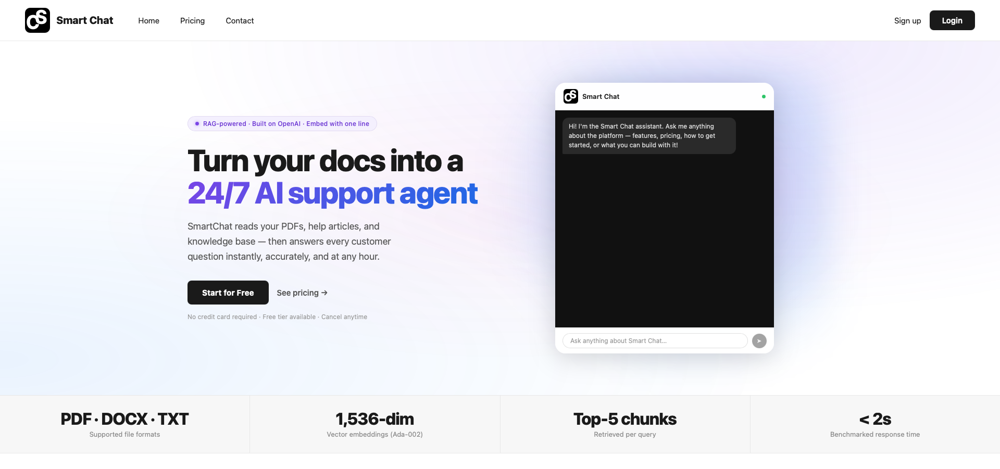

### How it works
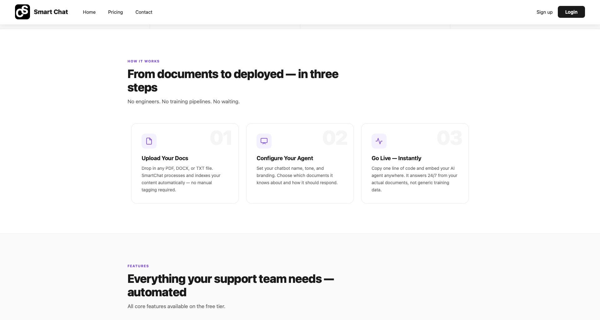

### Features
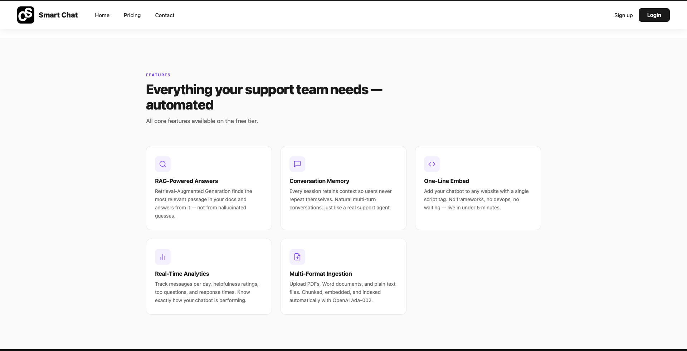

### Login
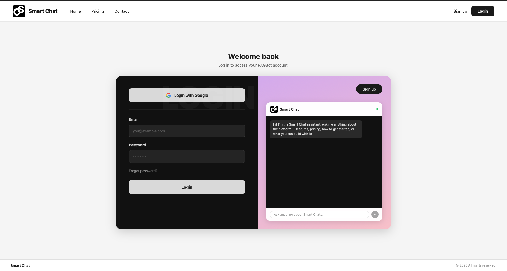

### Agent dashboard
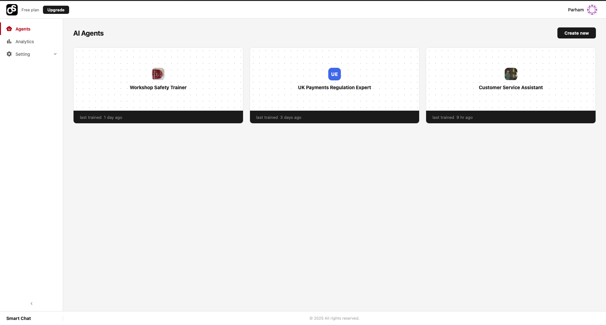

### Playground — test your agent
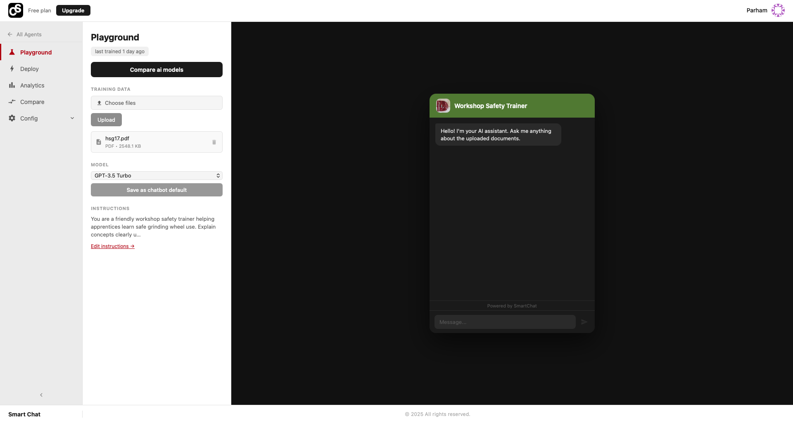

### AI model selection
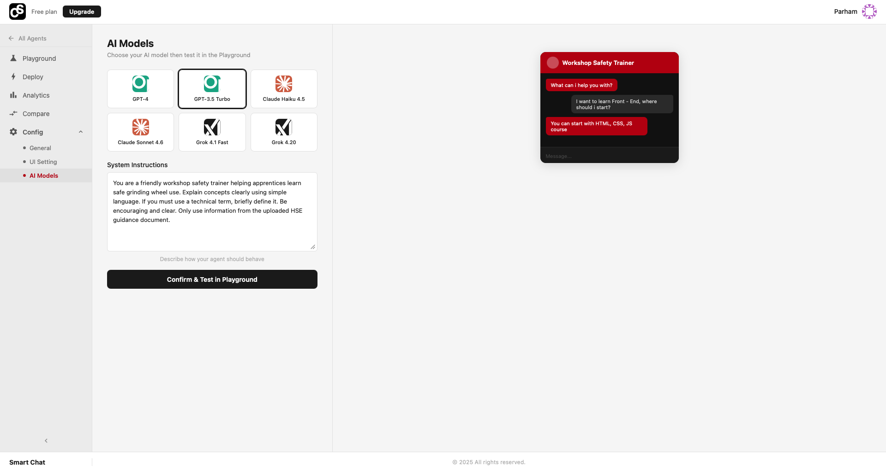

### Model comparison — same question, multiple models side by side
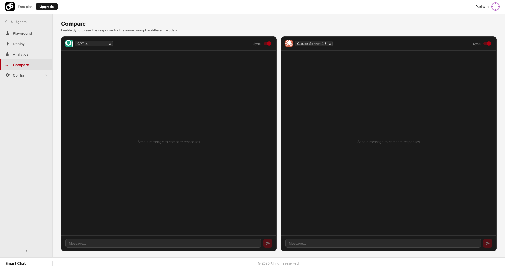

### Deploy — one-line embed snippet
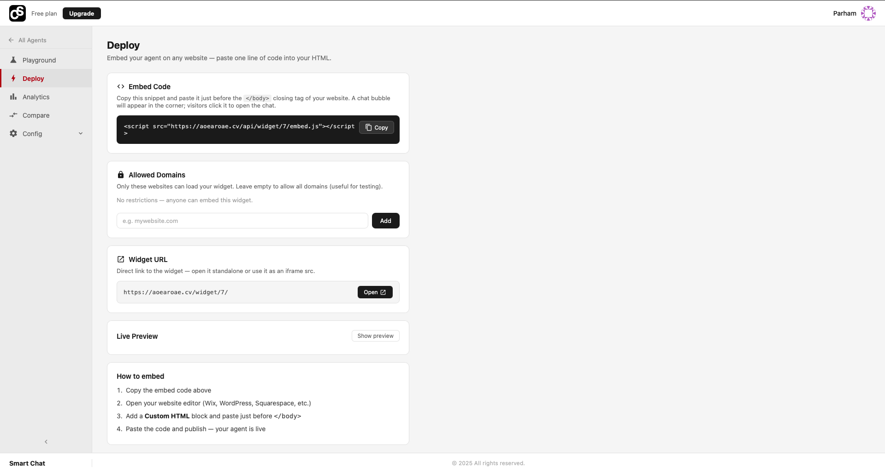

### Widget live on a real website
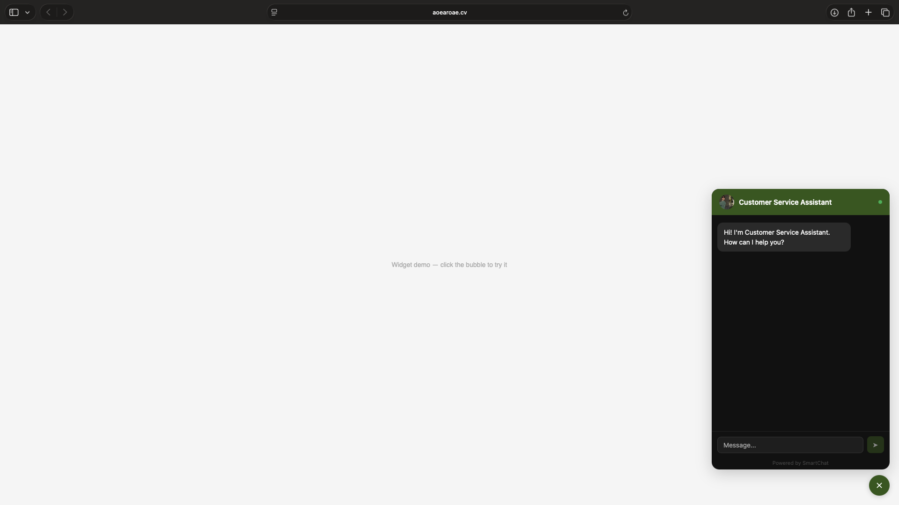

### Agent analytics
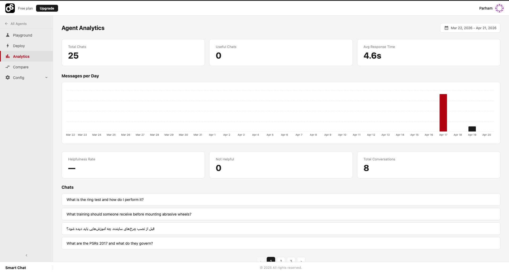

### Platform-wide analytics (all agents)
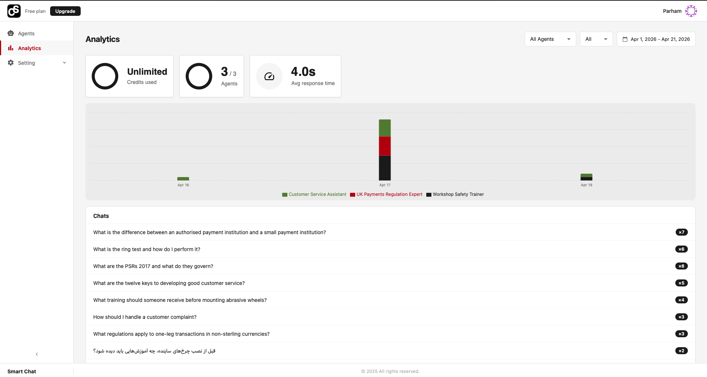

### Widget UI customisation
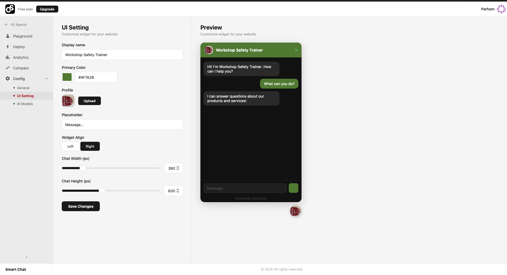

### API keys management
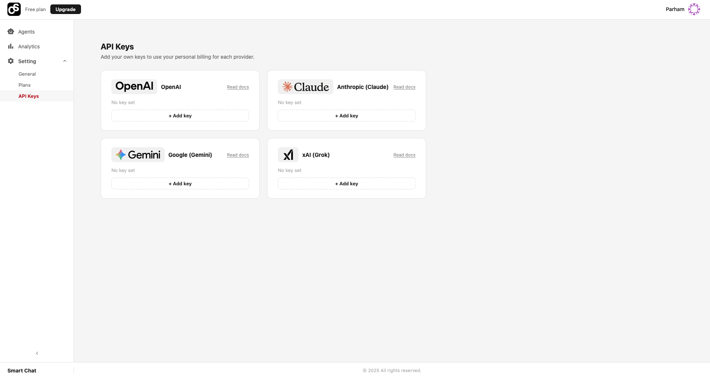

### Pricing
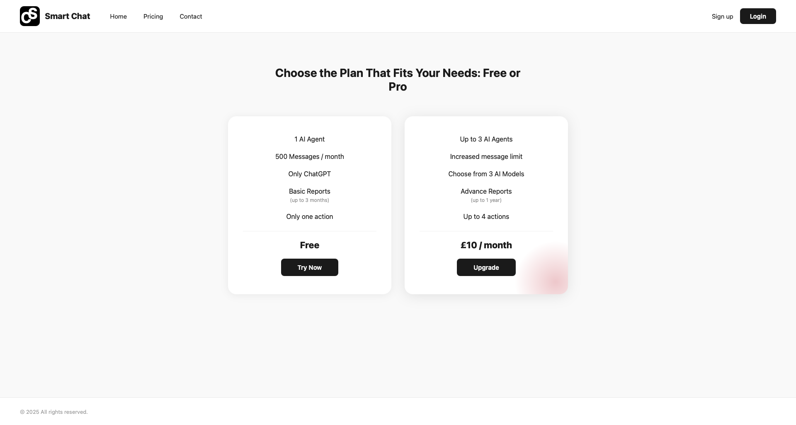

---

## What it does

You upload your documents (PDF, DOCX, TXT), SmartChat chunks and embeds them using OpenAI Ada-002, and stores the vectors in PostgreSQL via pgvector. When someone sends a message, the platform retrieves the most relevant chunks using cosine similarity and injects them into the prompt before calling whichever AI model is configured for that agent. The whole thing runs behind an embeddable widget that you drop onto any website with a single script tag.

---

## Features

**Agents**
- Create multiple agents, each with its own name, avatar, personality, and knowledge base
- Upload PDFs, Word docs, or plain text files as training data
- Choose from 6 AI models across 3 providers per agent
- Write custom system instructions or use a built-in tone preset

**RAG pipeline**
- Documents chunked at 750 tokens with 75-token overlap using `tiktoken`
- Each chunk embedded with OpenAI Ada-002 (1536 dimensions) and stored in pgvector
- Top-5 chunks retrieved per query using cosine similarity (`<=>` operator)
- Agentic mode available: Claude decides when and how many times to search, rather than always pre-retrieving

**Multi-model support**
- OpenAI: GPT-4, GPT-3.5 Turbo
- Anthropic: Claude Haiku 4.5, Claude Sonnet 4.6
- xAI: Grok 4.1 Fast, Grok 4.20
- Compare view: run the same prompt across multiple models simultaneously, responses fire in parallel

**Embeddable widget**
- One-line `<script>` embed generated per agent
- Fully customisable — colour, avatar, display name, placeholder text, width, height, alignment
- Works on any website with no auth required
- Domain allowlist to restrict where the widget loads

**Analytics**
- Messages per day bar chart (peak day highlighted)
- Most frequent user questions with repeat counts, paginated
- Helpfulness rate from thumbs up/down feedback on each response
- Average response time per agent
- Platform-wide view across all agents with per-agent breakdown

**Auth & accounts**
- JWT authentication with token blacklisting on logout
- Google OAuth (one-click sign in/up)
- Email verification on registration
- Password reset via email (1-hour token expiry)
- Monthly usage quota enforced — HTTP 429 when limit is hit

**Plans**
- Free: 1 agent, 500 messages/month, GPT only
- Pro (£10/month): up to 3 agents, increased message limit, all 3 AI providers, 1 year of analytics history, remove "Powered by SmartChat" branding

---

## Tech stack

| Layer | Technology |
|---|---|
| Backend | Django 4 + Django REST Framework |
| Database | PostgreSQL 15 + pgvector |
| Embeddings | OpenAI Ada-002 (1536 dims) |
| Frontend | React 18 + Material UI |
| Auth | JWT (SimpleJWT) + Google OAuth |
| Containerisation | Docker + Docker Compose + Nginx |
| Testing | pytest + pytest-django |

---

## Architecture

```
Browser
  └── React SPA
        ├── /              → landing page
        ├── /pricing       → pricing page
        ├── /dashboard     → agent management
        ├── /analytics     → platform-wide usage
        ├── /settings/*    → account, plans, API keys
        └── /widget/:id    → embeddable chat (no auth)

Nginx
  ├── /api/*  → Django REST API (port 8000)
  └── /*      → React static build

Django
  ├── accounts/    → auth, user model, email flows, usage quota
  ├── chatbots/    → agents, conversations, messages, widget, compare
  ├── documents/   → upload, text extraction, chunking, embeddings
  ├── analytics/   → messages per day, frequent questions, summary
  └── services/
        └── rag_service.py   → RAG pipeline, agentic search, multi-provider

PostgreSQL + pgvector
  └── document_chunks.embedding  → vector(1536), cosine similarity
```

---

## Getting started

### Prerequisites
- Python 3.11+
- Node 20+
- PostgreSQL 15 with pgvector extension
- An OpenAI API key (required for embeddings)

### 1. Backend

```bash
cd backend
python -m venv venv
source venv/bin/activate
pip install -r requirements.txt
```

Create `backend/.env`:

```
SECRET_KEY=your-django-secret-key
DB_NAME=ragbot
DB_USER=postgres
DB_PASSWORD=yourpassword
DB_HOST=localhost
DB_PORT=5432
OPENAI_API_KEY=sk-...
BASE_URL=http://localhost:3000
```

```bash
python manage.py migrate
python manage.py runserver
```

### 2. Frontend

```bash
cd frontend
npm install
npm start
```

### 3. Docker (everything at once)

```bash
docker-compose up --build
```

App available at `http://localhost:3000`.

---

## Tests

```bash
cd backend
source venv/bin/activate
python -m pytest -v
```

Tests use an in-memory SQLite database — `conftest.py` handles setup automatically.

---

## Performance

| Metric | Target | Result |
|---|---|---|
| Avg response time | < 3,000ms | ~1,100ms (benchmarked) |
| Message quota enforcement | HTTP 429 | Enforced on owner + caller |
| Error handling | All endpoints covered | try/except on every view |
| User data isolation | JWT + owner checks | Enforced across all queries |

---

## Project structure

```
ragbot-project/
├── backend/
│   ├── accounts/         # auth, user model, email flows
│   ├── chatbots/         # agents, conversations, messages, widget, compare
│   ├── documents/        # upload, processing, chunking, embeddings
│   ├── analytics/        # usage stats endpoints
│   └── services/
│       └── rag_service.py
├── frontend/
│   └── src/components/
│       ├── Landing/      # HomePage, PricingPage, LandingNavbar
│       ├── Dashboard/    # agent cards grid
│       ├── Chatbots/     # playground, compare, chat interface, deploy
│       ├── Analytics/    # charts, stat cards
│       ├── Settings/     # general, plans, API keys
│       └── Layout/       # AppLayout, sidebar, navbar, footer
├── docs/screenshots/     # README screenshots
├── scripts/              # benchmarking and evaluation
├── docker-compose.yml
├── Dockerfile
└── Dockerfile.frontend
```

---

## About

Built solo as a BSc Computer Science final year project. The core question was whether a RAG-based approach could deliver accurate, grounded responses within a 3-second latency budget for a real-world embeddable chatbot — benchmarks say yes, comfortably.
